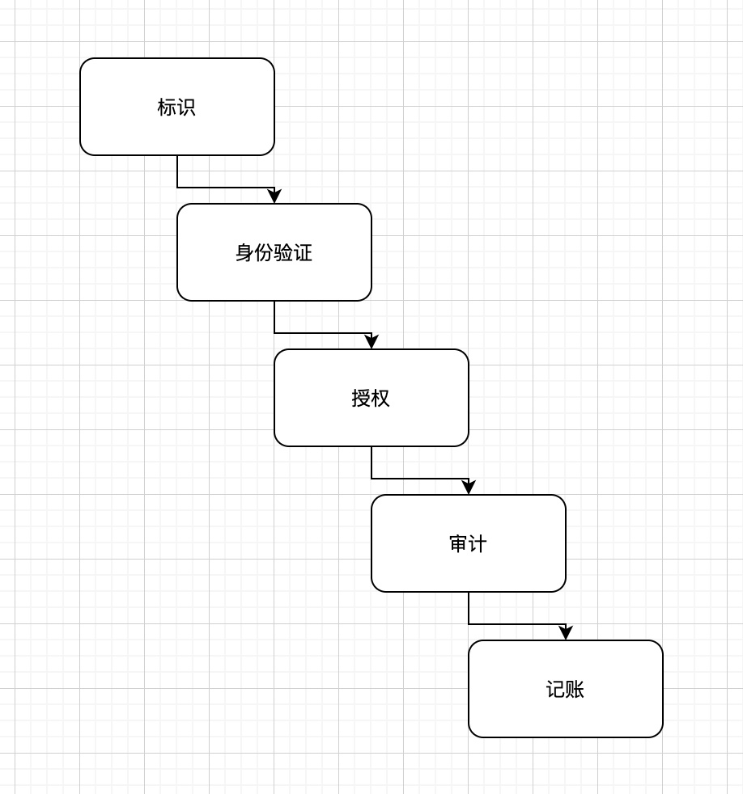

# 实现安全治理的原则和策略
安全必须要有起点。通常这个起点是最重要的安全原则列表。在这个列表中，保密性、完整性和可用性(Confidentiality, Integrity and Availability, · CIA)始终存在，因为它们经常被视为安全基础架构中主要的安全目标和宗旨。
## 保密性
- 概述：保密性指为保障数据、客体或资源保密状态而采取的措施。保密性保护的目标是阻止或最小化未经授权的数据访问。
- 有利措施：包括加密、填充网络流量、严格的访问控制、严格的身份验证程序、隐写术、数据分类和充分的人员培训
- 主客体概念
- 攻击例子：抓包网络流量与窃取密码文件，以及社会工程、端口扫描、肩窥、窃听、嗅探、特权升级等。违反保密性的行为不仅包括直接的故意攻击，也包括许多由人为错误、疏忽或不称职造成的未经授权的敏感或机密信息泄露。致使违反保密性的事件包括：未正确实现的加密传输，在传输数据前未对远程系统充分进行身份验证，开放的非安全访问点，访问恶意代码打开的后门，错误路由传真，文件遗留在打印机上，甚至在访问终端仍显示数据时走开。
- 关系：保密性和完整性相互依赖。没有客体完整性（换句话说，没能力保证客体不受未经授权的修改），就无法维持客体保密性。
- 其他相关概念、条件和特征
  - 敏感性 - 这种特性的数据一旦泄露会导致伤害或损失
  - 判断力 - 一种操作者可影响或控制信息泄露，以将伤害或损失程度降至最低的决策行为
  - 关键性 - 关键级别越高，越需要保持信息的保密性
  - 隐藏 - (Concealment)指藏匿或防止泄露的行为。与隐藏相关的一个概念是通过晦涩获得安全，即试图通过隐藏、沉默或保密获得保护。虽然通过晦涩保持安全的有效性未得到公认，但有些情况下它仍然有价值
  - 保密 - 指对某事保密或防止信息泄露的行为
  - 隐私 - 指对个人身份或可能对他人造成伤害、令他人感到尴尬的信息保密
  - 隔绝 - (Seclusion)就是把东西放在不可到达的地方
  - 隔离 - (Isolation)是保持把某些事物与其他事物分离的行为
---
## 完整性
- 概述：完整性是保护数据可靠性和正确性的概念。完整性保护措施防止了未经授权的数据更改。恰当实施的完整性保护措施允许合法修改数据，同时可预防故意和恶意的未经授权的活动（如病毒和入侵）以及授权用户的误操作（如错误或疏忽）。如果安全机制提供了完整性，它就高度保证数据、客体和资源不会由最初的受保护状态转变到非保护状态。
- 检验完整性
  - 防止未经授权的主体进行修改。
  - 防止授权主体进行未经授权的修改，如引入错误。
  - 保持客体内外，-致以使客体的数据能够真实反映现实世界，而且与任何子客体、对等客体或父客体的关系都是有效的、一致的和可验证的。
- 攻击例子：包括病毒、逻辑炸弹、未经授权的访问、修改或删除文件，输入无效的数据，修改配置时在命令、代码和脚本中引入错误，引入的病毒、执行恶意代码（如特洛伊木马）、故意替换及系统后门。与保密性一样，能破坏完整性的不仅有蓄意攻击。人为错误、疏忽或不称职造成了很多未经授权修改敏感信息的案例。
- 控制措施：包括严格的访问控制、严格的身份验证流程、入侵检测系统、客体／数据加密、散列值验证、接口限制、输入功能检查和充分的人员培训。
- 关系：完整性依赖于保密性。
- 其他概念、条件和特征
  - 准确性：正确且精确无误。
  - 真实性：真实地反映现实。
  - 可信性：可信的或非伪造的。
  - 有效性：实际上（或逻辑上）是正确的。
  - 不可否认性：不能否认执行过某个动作或活动，或能证明通过了某个通信或事件的初始验证。
  - 问责制：对行为和结果负有责任或义务。
  - 职责：负责或控制某人或某事。
  - 完整性：拥有全部需要和必要的组件或部件。
  - 全面性：完整的范围，充分包含所有需要的元素。
  - 不可否认性：(Nonrepudiation)确保事件的主体或引发事件的人不能否认事件的发生。通过标识、身份验证、授权、问责制和审计使不可否认性成为可能。可使用数字证书、会话标识符、事务日志以及其他许多事务性机制和访问控制机制来实施不可否认性
---
## 可用性
- 概念：授权主体被授予实时的、不间断的客体访问权限。通常，可用性保护控制措施提供组织所需的充足带宽和实时的处理能力。可用性包括对客体的有效的持续访问及抵御拒绝服务(DoS)攻击。可用性还意味着支撑性基础设施（包括网络服务、通信和访问控制机制）是可用的，并允许授权用户获得授权的访问。要在系统上维护可用性，必须有适当的控制措施以确保授权的访问和可接受的性能水平，能快速处理终端，能提供冗余，能维护可靠的备份，能防止数据丢失或受损。
- 攻击例子：包括设备故障、软件错误和环境问题（过热、静电、洪水、断电等）。还有一些聚焦于破坏可用性的攻击形式，包括DoS 攻击、客体破坏和通信中断。与保密性和完整性一样，对可用性的侵犯不仅限千蓄意攻击。许多未经授权修改敏感信息的实例都是由人为错误、疏忽或不称职造成的。导致可用性破坏的一些事件包括意外删除文件、滥用硬件或软件组件、资源分配不足、错误标记或错误的客体分类。破坏可用性的原因可能是任意用户（包括管理员）的操作。安全策略中的疏漏或配置有误的安全控制也会破坏可用性。

- 预防措施：包括正确设计中转传递系统、有效使用访问控制、监控性能和网络流量、使用防火墙和路由器防止DoS 攻击、对关键系统实施冗余机制以及维护和测试备份系统。大多数安全策略以及业务连续性计划(BCP)关注不同级别的访问／存储／安全（即磁盘、服务器或站点）上的容错特性，目标是消除单点故障，保障关键系统的可用性。
- 关系：可用性依赖于完整性和保密性。
- 其他相关概念、条件和特征
  - 可用性：能够容易被主体使用或学习的状态，或能被主体理解和控制。
  - 可访问性：保证全部授权主体可与资源交互而不考虑主体的能力或限制。
  - 及时性：及时、准时，在合理的时间内响应，或提供低时延的响应。
---
## 其他安全概念
### AAA 服务的概念
这3 个字母A 分别代表身份验证(Authentication)、授权(Authorization)和记账(Accounting) ；最后一个A 有时也指审计(Auditing)。尽管缩写中只有三个字母，但实际上代表了五项内容：标识(Identification)、身份验证、授权、审计和记账，如图

- 标识：当试图访问受保护的区域或系统时声明自己的身份。一旦主体被标识（即，一旦主体的身份被标识和验证），该主体要对其接下来的所有行为负责
- 身份验证：验证或测试声明的身份是否有效。用千身份验证的身份验证因子通常被标记为或被认为是私有信息。主体和系统对身份验证因子的保密能力直接反映了系统的安全性水平
  - 你知道的东西（如密码、PIN)
  - 你拥有的东西（如密钥、令牌、智能卡）
  - 你具备的东西（即生物特征识别，如指纹、虹膜或语音识别）
- 授权：对一个具体身份定义其对资源和客体的访问许可（如：允许／授予和／或拒绝）。标识和身份验证体现了访问控制的全有或全无特性。对千环境中的每个主体，授权在全部允许或全部拒绝之间有广泛的变化。自主访问控制(Discretionary Access Control, DAC)、强制访问控制(MandatoryAccess Control, MAC)或基于角色的访问控制(Role Based Access Control, RBAC 或角色BAC)
- 审计：记录系统、主客体相关的事件与活动日志。监控是审计的组成部分，而审计日志是监控系统的组成部分，但监控和审计这两个术语具有不同含义。监控是一种观测或监督，而审计是把信息记录到档案或文件。可在没有审计的情况下进行监控。不过如果没有某种形式的监控，则无法进行审计
- 记账（又名问责制）：通过审查日志文件来核查合规和违规情况，以便让主体对自身行为负责。
### 保护机制
- 分层(layering) - 也被称为纵深防御，指简单使用一系列控制中的多个控制。没有哪个控制能防范所有可能的威胁。使用多层防护解决方案允许使用许多不同的控制措施来抵御随时出现的威胁。在设计分层防护安全解决方案时，一个控制失效不会导致系统或数据暴露。使用串行层而不是并行层是很重要的。
- 抽象(abstraction) - 是为了提高效率。相似的元素被放入组、类或角色中作为一个集合被指派安全控制、限制或许可。因此，可将抽象的概念应用到对客体进行分类或向主体分配角色。抽象概念还包括对客体和主体类型的定义或客体自身的定义（即，用千定义实体类的模板的数据结构）。抽象用于定义客体可包含哪些类型的数据、可在该客体上或由该客体执行哪些类型的功能以及该客体具有哪些功能。抽象使你可将安全控制分配给按类型或功能归类的客体集，由此简化安全。
- 数据隐藏 - 将数据存放在主体无法访问或读取的逻辑存储空间以防止数据被泄露或访问。数据隐藏的形式包括防止未经授权的访问者访问数据库，以及限制安全级别较低的主体访问安全级别较高的数据。阻止应用程序直接访问存储硬件也是一种数据隐藏形式。数据隐藏通常是安全控制和编程中的关键元素。
- 通过隐匿(obscurity)保持安全 - 与数据隐藏是类似的，不过通过隐匿保持安全是另一种概念。数据隐藏是指故意将数据存放在未授权的主体无法查看或访问的位置，而通过隐匿保持安全是指不告知主体有客体存在，从而希望主体不发现该客体。通过隐匿保持安全实际上并没有提供任何形式的保护。通过隐匿保待安全的一个实例是：虽然程序员知道软件代码存在缺陷，但他们还是发布了产品，并希望没人会发现和利用代码中存在的缺陷。
- 加密(encryption) - 是关于对非预期的接收者隐藏通信的真实含义和意图的艺术与科学，它能将信息传递的意义或意图隐藏起来。较弱或较差的加密可被认为类似于隐匿或通过隐匿保持安全