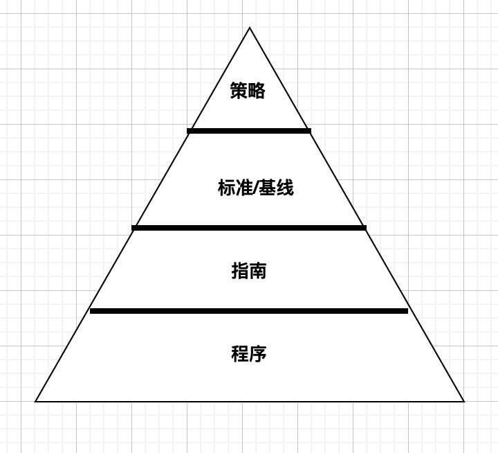

# 开发、记录和实施安全策略、标准、程序和指南
开发和实现文档化的安全策略、标准、程序和指南可以生成可靠的、可依赖的安全基础设施。这种规范化过程极大地减少了IT 基础设施设计和实现的安全解决方案中的混乱和复杂性。

## 安全策略
- 概述：规范化的最高层级文件是安全策略。安全策略定义了组织所需的安全范围，所有相关术语，确定了数据处理的主要功能领域，讨论需要保护的资产（安全目标）以及安全解决方案需要提供的必要保护程度。安全策略是安全实施的战略计划。安全策略是强制性的。
- 具体：安全策略讨论了安全对日常业务运营的各个方面的重要性，以及高级管理者支持安全实施的重要性。安全策略用于分配职责、定义角色、指定审计需求、概述实施过程、确定合规性需求和定义可接受的风险级别。安全策略常用来证明高级管理者在保护组织免受入侵、攻击和灾难时已经给予了应尽关心。
- 特定安全策略：特定问题的安全策略集中在特定的网络工作服务、部门、功能或有别于组织整体的其他不同方面。特定系统的安全策略关注于单个系统或系统类型，并规定了经过批准的硬件和软件，概述了锁定系统的方法，甚至强制要求采用防火墙或其他特定的安全控制。
- 三大类综合安全策略：监管性策略、建议性策略和信息性策略。当组织有需要遵守的行业或法律标准时，就需要监管性策略。该策略讨论了必须遵守的法规，并概述了用于促进满足监管要求的程序。建议性策略讨论可接受的行为和活动，并定义违规的后果。它说明了高级管理者对组织内安全性和合规性的期望，大多数策略都是建议性的。信息性策略旨在提供关千特定主体的信息或知识，如公司目标、任务声明或组织如何与合作伙伴和客户交流。信息性策略提供与整体策略特定要素相关的支持、研究或背景信息。
- 可接受的使用策略：可接受的使用策略是一个常规生成的文档，它是整个安全文档基础结构的一个组成部分。可接受的使用策略专门用来分配组织内的安全角色，并确保职责与这些角色相关联。该策略定义了可接受的性能级别及期望的行为和活动。不遵守该策略可能导致工作行为警告、处罚或解聘。
---

## 标准、基线、指南和程序
使用金字塔可以传达每种文档的大小。完整安全策略中的程序通常远远超过任何单个元素的程序

- 标准：对硬件、软件、技术和安全控制方法的一致性定义了强制性要求。标准提供了在整个组织中统一实施技术和程序的操作过程。标准是战术计划文档，规定了达到安全策略定义的目标和总体方向的步骤或方法。
- 基线：定义了整个组织中每个系统必须满足的最低安全级别。所有不符合基线要求的系统在满足基线要求之前都不能上线生产。基线建立了通用的基础安全状态，在此
之上可实施所有额外的、更严格的安全措施。基线通常是系统特定的，一般参考行业或政府标准，如TCSEC（可信计算机系统评估标准）或ITSEC（信息技术安全评估和标准）或NIST（美国国家标准与技术研究院）标准。
- 指南：是规范化安全策略结构中基线的下一个元素。指南提供了关于如何实现标准和基线的建议，并作为安全专业人员和用户的操作指南。指南说明应该部署哪些安全机制，而不是规定特定的产品或控制措施，并详细说明配置。指南概述了方法（包括建议的行动），但并非强制性的。
- 程序：是规范化安全策略结构的最后一个元素。标准操作程序(Standard Operating Procedure,SOP)是详细的分步实施文档，描述了实现特定安全机制、控制或解决方案所需的具体操作。程序可讨论整个系统部署操作，或关注单个产品或方面，如部署防火墙或更新病毒定义。大多数情况下，程序是针对特定系统和软件的。程序必须随着系统硬件与软件的发展而不断更新。程序的目的是确保业务流程的完整性。如果一切都是通过遵循详细的程序来完成的，那么所有活动都应该遵守策略、标准和指南。
- 将这些文档作为独立实体保存有几个好处
  - 并非所有用户都需要知道所有安全分类级别的安全标准、基线、指南和程序。
  - 当发生更改时，可以较方便地只更新和重新分发受影响的策略，而不是更新全部策略并在整个组织中重新分发。
